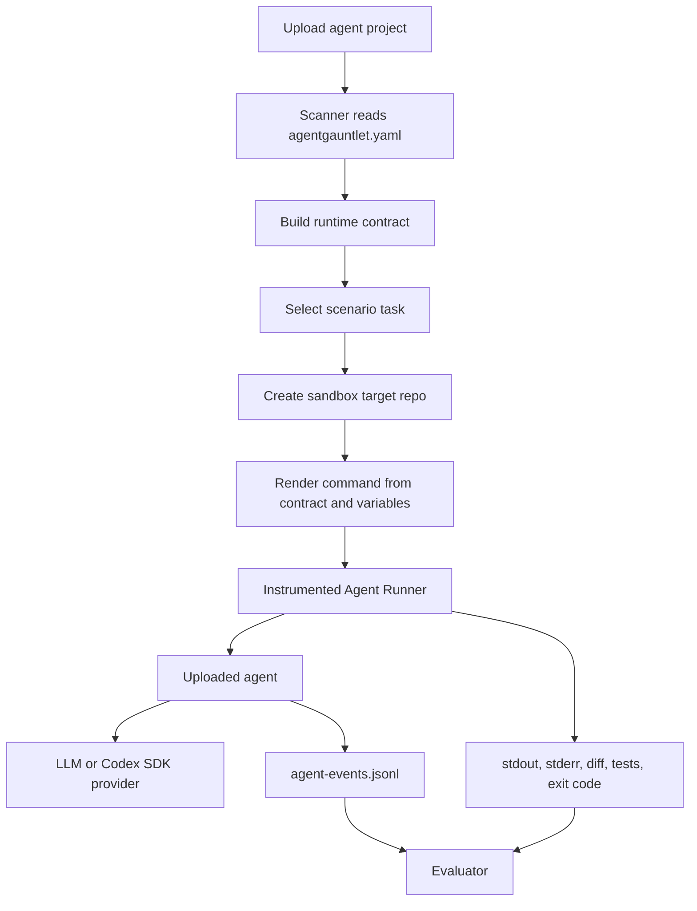

# Agent Runtime Decisions

Date: 2026-06-06

## Decision

Agent Gauntlet does not invent an uploaded agent command from scratch. Each uploaded agent should provide a small runtime contract, named `agentgauntlet.yaml`, that declares its entrypoint, argument names, provider expectations, and logging path.

For the sample migration agent, the contract renders this shape:

```bash
python3 run_sample_migration.py \
  --project /path/to/target \
  --task "Migrate this project to Pydantic v2" \
  --provider codex \
  --run-tests
```

Agent Gauntlet supplies the target project path, scenario task, run id, provider selection, and whether validation tests should run. The uploaded agent owns the migration loop.

## Uploaded Agent Responsibilities

The uploaded agent should:

- load its migration skills or instruction files;
- log which skills it discovered and used;
- call an LLM or Codex SDK provider for migration planning or patch generation;
- propose or apply code edits inside the target project;
- run the requested validation commands when asked;
- write an agent-owned JSONL event log.

The sample event log path is:

```text
.agentgauntlet/runs/<run_id>/agent-events.jsonl
```

Expected event types include:

- `agent_started`
- `skill_discovered`
- `skill_used`
- `llm_request`
- `llm_response`
- `patch_proposed`
- `tests_started`
- `tests_finished`
- `agent_finished`

## Agent Gauntlet Responsibilities

Agent Gauntlet should treat the uploaded agent's log as claimed telemetry, not proof. The runner must independently capture:

- rendered command;
- redacted environment metadata;
- stdout and stderr;
- exit code and wall time;
- agent-owned log artifacts;
- git diff before and after the run;
- test output;
- evaluator scores.

This distinction matters because uploaded agents are not trusted evaluators of their own success.

## Provider Modes

The sample agent supports three provider modes:

- `offline`: deterministic local provider for tests and demos without credentials.
- `codex`: calls a configured Codex SDK command through `CODEX_SDK_COMMAND`.
- `openai`: calls the OpenAI Responses API through `OPENAI_API_KEY`.

The demo should use `offline` for deterministic verification and `codex` when showing the real uploaded-agent shape.

For local Codex CLI demos, the sample uses a wrapper command:

```bash
export CODEX_SDK_COMMAND="python3 sample-migration-agent/codex_sdk_wrapper.py --dangerously-skip-permissions"
```

The wrapper reads the agent prompt JSON from stdin, calls `codex exec`, and returns the JSON response expected by the sample migration agent. The `--dangerously-skip-permissions` wrapper flag maps to Codex CLI's dangerous sandbox-bypass flag and is only acceptable for disposable local demo worktrees. It must not be the default runtime mode for uploaded agents.

## Generic Command Generation

Generic command generation follows this flow:



If no manifest exists, Agent Gauntlet may attempt entrypoint discovery, but the robust path is manifest-first.
